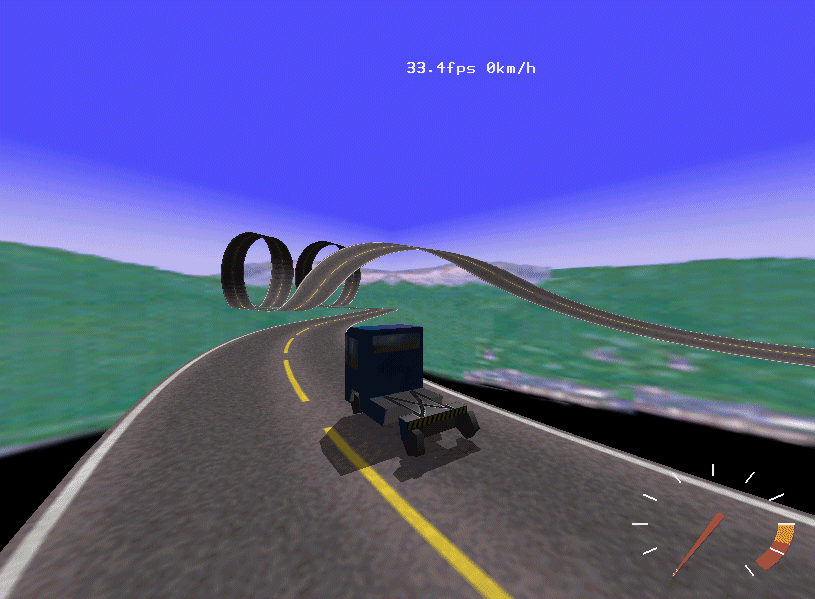

# CarWorld

CarWorld is a small open-source 3D driving simulator and vehicle-mechanics
demonstration. It was originally developed as a student project and later used
to experiment with rendering, input, networking, and vehicle simulation.



## Project status

CarWorld is a historical project that is being restored and modernized. The
original SourceForge repository, website, release history, and available
packages have been preserved on GitHub.

The current source predates modern build systems and has not yet been verified
against current Linux or Windows toolchains. Build instructions will be
expanded after reproducible builds are established.

## Features

- Classical-mechanics vehicle simulation using metric units
- Configurable mass, inertia, suspension, damping, torque, and friction
- OpenGL rendering with textured models and projected shadows
- SDL-based windowing, input, image loading, and joystick support
- Interactive in-game console
- Experimental networked client/server mode
- Linux and Windows project files

## Requirements

The source currently references:

- A C++ compiler
- SDL2
- SDL2_image
- SDL2_net
- OpenGL and GLU

Exact supported versions and platform packages have not yet been verified.

## Building

The repository contains a legacy `Makefile` and Visual Studio project files in
[`msdev/`](msdev/). They are retained for restoration work, but the build
commands and dependency setup have not yet been validated on current systems.

Until that validation is complete, the original packages are available from
[GitHub Releases](https://github.com/UltraFly/carworld/releases).

## Running

CarWorld expects to be started from the root of its distribution so it can find
the files under `data/`.

Historical controls:

| Control | Action |
| --- | --- |
| Arrow keys | Control the vehicle |
| Space | Handbrake |
| Tab | Open the in-game console |
| F2–F5 | Change views and options |

The application uses `carworld.cfg` as its historical configuration filename.

## Networking

Network play is experimental. Historically, a server was started with:

```text
carworld -server
```

A running client could then use the in-game console:

```text
join <server-name>
```

This functionality has not yet been verified on current systems.

## Documentation

- [Project website](https://ultrafly.github.io/carworld/)
- [Historical changelog](CHANGELOG.md)
- [Releases](https://github.com/UltraFly/carworld/releases)
- [Issue tracker](https://github.com/UltraFly/carworld/issues)

The original SourceForge project remains available as a read-only historical
archive.

## Contributing

Bug reports, build fixes, portability work, documentation improvements, and
tested platform instructions are welcome. See [CONTRIBUTING.md](CONTRIBUTING.md)
before submitting a change.

## License

CarWorld is licensed under the GNU General Public License version 3. See
[LICENSE](LICENSE).
